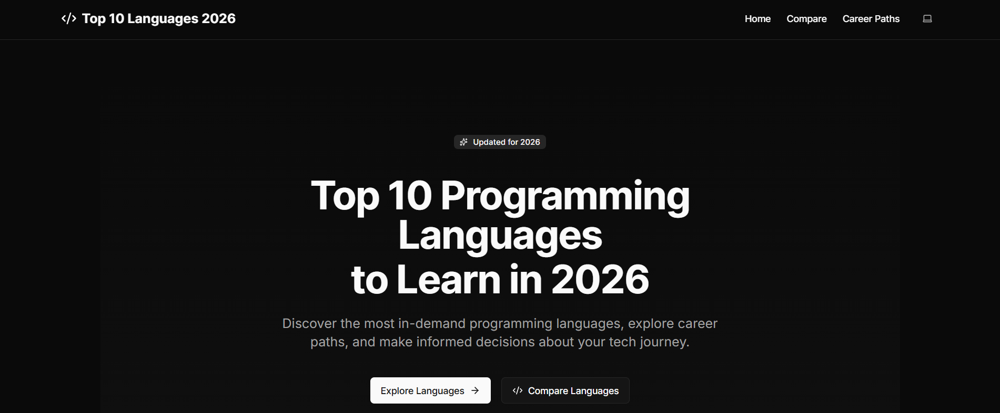
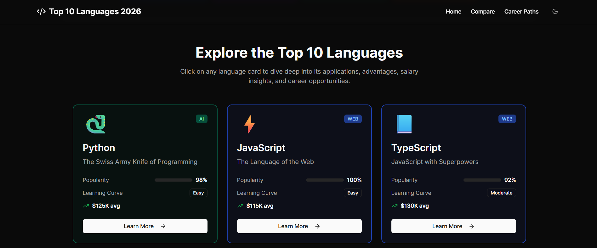

# 🚀 Top 10 Programming Languages to Learn in 2026

[](https://nextjs.org/)
[](https://www.typescriptlang.org/)
[](https://tailwindcss.com/)
[](https://ui.shadcn.com/)
[](https://opensource.org/licenses/MIT)

A modern, responsive Next.js 15 application that showcases the top 10 programming languages for 2026 with beautiful, data-rich pages, an interactive comparison tool, and career path visualizations.

Built with TypeScript, Tailwind CSS, and shadcn/ui. Fully responsive, theme-aware, and production-ready.



---



---

## ✨ Highlights

- **Next.js 15 App Router** (TypeScript) with static generation
- **Clean, card-based homepage** with domain color-coding
- **Dynamic, rich language detail pages** with salary visualization
- **Side-by-side comparison tool** (2–3 languages)
- **Career paths** with an interactive flowchart
- **Breadcrumbs, persistent header/sidebar**, and mobile-ready UI
- **Dark/light theme** via shadcn/ui
- **Comprehensive Footer** with navigation and social links
- **Fully responsive** design across all devices

---

## 📋 Table of Contents

- [Features](#features)
- [Information Architecture](#information-architecture)
- [Tech Stack](#tech-stack)
- [Getting Started](#getting-started)
- [Project Structure](#project-structure)
- [Data Model](#data-model)
- [UI/UX & Theming](#uiux--theming)
- [Accessibility & Performance](#accessibility--performance)
- [Deployment](#deployment)
- [Contributing](#contributing)
- [Roadmap](#roadmap)
- [FAQ](#faq)
- [License](#license)
- [Acknowledgements](#acknowledgements)

---

## 🎯 Features

### **1. Homepage (/)**

- **Hero section** with a compelling value proposition
- **Stats overview** (10 languages, salary ranges, domains)
- **Domain categorization** (Web, Mobile, AI, Systems; plus Data, Game Dev where relevant)
- **Card-based language grid** with domain color-coding
- **Each card displays**: icon, name, tagline, popularity bar, learning curve, average salary
- **Call-to-action** to explore career paths

### **2. Individual Language Pages (/language/[id])**

- **Dynamic routes** for all 10 languages
- **Breadcrumb navigation** for easy orientation
- **Hero section** with icon, name, domain badge, and key statistics
- **Comprehensive sections**:
  - Overview with detailed description
  - Key applications (bullet points)
  - Key advantages (bullet points)
  - Interactive salary visualization with range slider
  - Career relevance section
- **Quick stats sidebar** with essential metrics
- **Previous/Next navigation** between languages

### **3. Compare Tool (/compare)**

- **Multi-language selection** (2–3 languages) with domain color-coding
- **Side-by-side comparison table** with normalized attributes
- **Detailed cards** for each selected language
- **Direct links** to full language detail pages

### **4. Career Paths Page (/career-paths)**

- **6 career categories**: Web, Mobile, AI, Systems, Data, Game Dev
- **Each category shows**:
  - Relevant programming languages
  - Common job roles
  - Salary ranges by experience level
- **Interactive progression flowchart** (Entry → Mid → Senior)
- **Salary visualization** for each career stage

### **5. Navigation & UI**

- **Persistent header navigation** with logo and menu
- **Mobile-responsive menu** using sheet/drawer component
- **Theme switcher** (light/dark mode) with persistence
- **Breadcrumb navigation** across all pages
- **Professional design** using shadcn/ui components
- **Domain-based color system** throughout the application
- **Comprehensive footer** with site links, social media, and branding

### **6. Technical Features**

- **Next.js 15 App Router** + TypeScript for type safety
- **Tailwind CSS** + shadcn/ui for consistent, accessible UI
- **Fully responsive** (mobile, tablet, desktop)
- **Dark mode support** with system preference detection
- **Static generation** for optimal performance on language pages
- **Type-safe data** and component architecture
- **Clean, modular component structure**
- **SEO optimized** with proper meta tags and structured data

---

## 🏗️ Information Architecture

```
/                     # Homepage with hero, stats, domain overview, language cards
├── /language/[id]     # Detail page per language with overview, applications, advantages, salary viz, career relevance
├── /compare           # Select and compare 2–3 languages side-by-side
├── /career-paths      # Career categories, language mapping, roles, progression flowchart, salaries
└── Shared Elements    # Persistent header, breadcrumbs, theme switcher, responsive sidebar/sheet, comprehensive footer
```

---

## 🛠️ Tech Stack

- **Framework**: Next.js 15 (App Router)
- **Language**: TypeScript 5
- **UI Framework**: Tailwind CSS 3.4+ with shadcn/ui
- **Icons**: Lucide React (via shadcn/ui integration)
- **State/Data**: Type-safe static data with route parameters
- **Charts/Visualization**: Custom range slider for salary visualization
- **Tooling**: ESLint, Prettier, TypeScript compiler
- **Package Manager**: npm
- **Deployment**: Vercel (recommended) or any Node.js hosting

---

## 🚀 Getting Started

### Prerequisites

- **Node.js**: 18+ (20+ recommended)
- **Package Manager**: npm, pnpm, or yarn

### Installation

1. **Clone the repository**

   ```bash
   git clone https://github.com/sisovin/program_languages_guide_2026.git
   cd program_languages_guide_2026
   ```

2. **Install dependencies**

   ```bash
   npm install
   ```

3. **Start development server**

   ```bash
   npm run dev
   ```

4. **Open your browser**
   Visit [http://localhost:3000](http://localhost:3000)

### Build Commands

```bash
# Development
npm run dev          # Start development server

# Production
npm run build        # Build for production
npm run start        # Start production server

# Code Quality
npm run lint         # Run ESLint
npm run typecheck    # Run TypeScript type checking

# Optional (if configured)
npm run format       # Format code with Prettier
npm run test         # Run tests
```

### Environment Variables

This project works without environment variables by default. If you add features like analytics or external APIs:

```bash
# .env.local
NEXT_PUBLIC_SITE_NAME="Top 10 Programming Languages 2026"
NEXT_PUBLIC_BASE_URL="http://localhost:3000"
NEXT_PUBLIC_ANALYTICS_ID="your-analytics-id"
```

---

## 📁 Project Structure

```
.
├── app/                          # Next.js App Router
│   ├── layout.tsx               # Root layout with theme provider
│   ├── page.tsx                 # Homepage
│   ├── globals.css              # Global styles and Tailwind imports
│   ├── compare/
│   │   └── page.tsx            # Language comparison tool
│   ├── career-paths/
│   │   └── page.tsx            # Career paths overview
│   └── language/
│       └── [id]/
│           └── page.tsx        # Dynamic language detail pages
├── components/                  # Reusable React components
│   ├── ui/                     # shadcn/ui components
│   ├── Header.tsx              # Main navigation header
│   ├── Footer.tsx              # Comprehensive site footer
│   ├── Breadcrumbs.tsx         # Navigation breadcrumbs
│   ├── LanguageCard.tsx        # Language preview cards
│   ├── SalaryVisualization.tsx # Salary range component
│   └── theme-switcher.tsx      # Dark/light theme toggle
├── data/                       # Static data and constants
│   └── languages.ts            # Language dataset
├── hooks/                      # Custom React hooks
│   └── use-mobile.ts           # Mobile detection hook
├── lib/                        # Utility functions
│   └── utils.ts                # General utilities
├── public/                     # Static assets
│   ├── favicon.ico
│   └── icons/                  # Language icons
├── styles/                     # Additional stylesheets
├── components.json             # shadcn/ui configuration
├── tailwind.config.ts          # Tailwind CSS configuration
├── tsconfig.json               # TypeScript configuration
├── next.config.js              # Next.js configuration
├── package.json                # Dependencies and scripts
└── README.md                   # This file
```

---

## 📊 Data Model

The application uses a type-safe data structure defined in TypeScript:

```typescript
// data/languages.ts
export type Domain = "web" | "mobile" | "ai" | "systems" | "data" | "gamedev";

export interface SalaryRange {
  currency: "USD";
  entry: number; // e.g., 60000
  mid: number; // e.g., 100000
  senior: number; // e.g., 150000
}

export interface Language {
  id: string; // e.g., 'typescript'
  name: string; // 'TypeScript'
  domain: Domain; // 'web'
  tagline: string; // Short summary
  popularity: number; // 0–100 scale
  learningCurve: "easy" | "moderate" | "steep";
  avgSalary: number; // For card display
  salary: SalaryRange; // For detailed visualization
  overview: string; // Detailed description
  applications: string[]; // Key use cases
  advantages: string[]; // Main benefits
  relevance: string; // Career context
  icon: string; // Icon identifier
  links?: {
    official?: string;
    docs?: string;
    tutorials?: string[];
  };
}
```

### Domain Color System

```typescript
export const DOMAIN_COLORS: Record<Domain, string> = {
  web: "bg-blue-500",
  mobile: "bg-emerald-500",
  ai: "bg-purple-500",
  systems: "bg-amber-500",
  data: "bg-cyan-500",
  gamedev: "bg-pink-500",
};
```

---

## 🎨 UI/UX & Theming

### Design System

- **shadcn/ui Components**: Button, Card, Sheet, Tabs, Table, Breadcrumb, Badge, Separator, etc.
- **Consistent Styling**: Tailwind CSS utility classes with design tokens
- **Color Coding**: Domain-based color system for visual organization

### Theme Support

- **Light and Dark Modes**: Complete theme switching with persistence
- **System Preference Detection**: Automatic theme based on user settings
- **Theme Switcher**: Accessible toggle in the header

### Responsive Design

- **Mobile-First**: Optimized for mobile devices
- **Tablet Support**: Adaptive layouts for medium screens
- **Desktop Enhancement**: Full feature utilization on large screens

### Navigation Patterns

- **Header Navigation**: Primary site navigation with logo
- **Breadcrumb Navigation**: Contextual page hierarchy
- **Sheet/Drawer**: Mobile-friendly navigation menu
- **Footer Links**: Comprehensive site navigation and social links

---

## ♿ Accessibility & Performance

### Accessibility Features

- **WCAG Compliant**: Meets accessibility standards
- **Keyboard Navigation**: Full keyboard support
- **Screen Reader Support**: Proper ARIA labels and semantic HTML
- **Color Contrast**: High contrast ratios in both themes
- **Focus Management**: Clear focus indicators and logical tab order

### Performance Optimizations

- **Static Generation**: Pre-rendered pages for instant loading
- **Image Optimization**: Next.js Image component for optimized images
- **Code Splitting**: Automatic route-based code splitting
- **Bundle Optimization**: Tree shaking and minification
- **Caching**: Appropriate caching headers and strategies

---

## 🚀 Deployment

### Vercel (Recommended)

1. **Connect Repository**
   - Push code to GitHub
   - Import project in Vercel dashboard

2. **Configure Build**
   - Framework preset: Next.js
   - Build command: `npm run build`
   - Output directory: `.next`

3. **Environment Variables**
   - Add any required environment variables

4. **Deploy**
   - Automatic deployments on push
   - Preview deployments for pull requests

### Self-Hosted Deployment

```bash
# Build the application
npm run build

# Start production server
npm run start
```

**Requirements:**

- Node.js 18+ runtime
- Reverse proxy (Nginx recommended)
- SSL certificate for HTTPS

### Docker Deployment (Optional)

```dockerfile
FROM node:18-alpine
WORKDIR /app
COPY package*.json ./
RUN npm ci --only=production
COPY . .
RUN npm run build
EXPOSE 3000
CMD ["npm", "start"]
```

---

## 🤝 Contributing

We welcome contributions! Please follow these guidelines:

### Development Workflow

1. **Fork the repository**
2. **Create a feature branch**
   ```bash
   git checkout -b feature/amazing-feature
   ```
3. **Make your changes**
4. **Run quality checks**
   ```bash
   npm run lint
   npm run typecheck
   ```
5. **Test your changes**
6. **Commit with conventional format**
   ```bash
   git commit -m "feat: add amazing feature"
   ```
7. **Push and create PR**

### Code Quality

- **TypeScript**: Strict type checking enabled
- **ESLint**: Code linting with Next.js rules
- **Prettier**: Consistent code formatting
- **Pre-commit hooks**: Automated quality checks

### Guidelines

- Follow existing code style and patterns
- Add TypeScript types for new features
- Update documentation for API changes
- Test on multiple devices and browsers
- Ensure accessibility compliance

---

## 🗺️ Roadmap

### Phase 1 (Current)

- ✅ Homepage with language cards
- ✅ Individual language detail pages
- ✅ Comparison tool
- ✅ Career paths with flowchart
- ✅ Responsive design and theming
- ✅ Footer with navigation

### Phase 2 (Upcoming)

- 🔄 **Internationalization (i18n)**
  - Multi-language support
  - Localized content
- 🔄 **Enhanced Data**
  - Live salary data integration
  - Regional salary filters
  - Updated language rankings
- 🔄 **User Features**
  - Bookmark/favorites system
  - Shareable comparisons
  - Export functionality (PDF/Image)
- 🔄 **Search & Discovery**
  - Full-text search
  - Tag-based filtering
  - Advanced sorting options

### Phase 3 (Future)

- 🔄 **Analytics & Insights**
  - Privacy-first analytics
  - User behavior tracking
  - Content performance metrics
- 🔄 **Community Features**
  - User reviews and ratings
  - Discussion forums
  - Expert contributor program
- 🔄 **Advanced Visualizations**
  - Interactive charts and graphs
  - 3D career path visualization
  - Real-time data dashboards

---

## ❓ FAQ

### General Questions

**Q: Which 10 languages are included?**
A: The current selection includes Python, JavaScript, TypeScript, Java, C++, C#, Go, Rust, Swift, and Kotlin. This can be updated in `data/languages.ts`.

**Q: How often is the data updated?**
A: The language rankings and salary data are updated annually. The current dataset reflects 2026 projections.

**Q: Is this data official?**
A: This is curated data based on industry trends, surveys, and market analysis. Always verify with current sources for the latest information.

### Technical Questions

**Q: Can I change domain colors or add domains?**
A: Yes! Edit the `DOMAIN_COLORS` object in your constants file and update corresponding Tailwind classes throughout the UI.

**Q: How do I add a new language?**

1. Add a new entry to `data/languages.ts`
2. Ensure the `id` is unique
3. Add an icon to `/public/icons/` if needed
4. Rebuild - SSG will generate the new page automatically

**Q: Can I integrate live salary data?**
A: Absolutely! Replace static data with API calls in server components or edge functions, then update types and components accordingly.

**Q: How do I customize the theme?**
A: Modify the Tailwind configuration in `tailwind.config.ts` and update CSS variables in `globals.css` for custom colors and styling.

### Usage Questions

**Q: How do I use the comparison tool?**
A: Navigate to `/compare`, select 2-3 languages using the visual grid, and view the side-by-side comparison table.

**Q: What do the salary ranges represent?**
A: Salary ranges show typical compensation for Entry (0-3 years), Mid (3-7 years), and Senior (7+ years) level positions in USD.

**Q: How are learning curves determined?**
A: Learning curves are based on community consensus, documentation quality, and typical time-to-productivity estimates.

---

## 📄 License

This project is licensed under the **MIT License** - see the [LICENSE](LICENSE) file for details.

---

## 🙏 Acknowledgements

- **Next.js Team** at Vercel for the amazing framework
- **shadcn** for the beautiful UI component system
- **Tailwind CSS** for the utility-first CSS framework
- **Lucide** for the comprehensive icon library
- **Community Contributors** for insights and feedback
- **Data Sources**: Stack Overflow, GitHub, industry surveys, and market analysis reports

---

## 📞 Support

- **Issues**: [GitHub Issues](https://github.com/sisovin/program_languages_guide_2026/issues)
- **Discussions**: [GitHub Discussions](https://github.com/sisovin/program_languages_guide_2026/discussions)
- **Email**: [Sisovin Chieng](sisovin@outlook.com)

---

_Built with ❤️ using Next.js, TypeScript, and modern web technologies._
